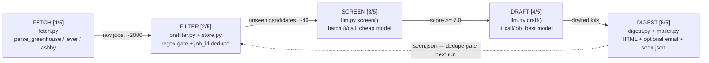
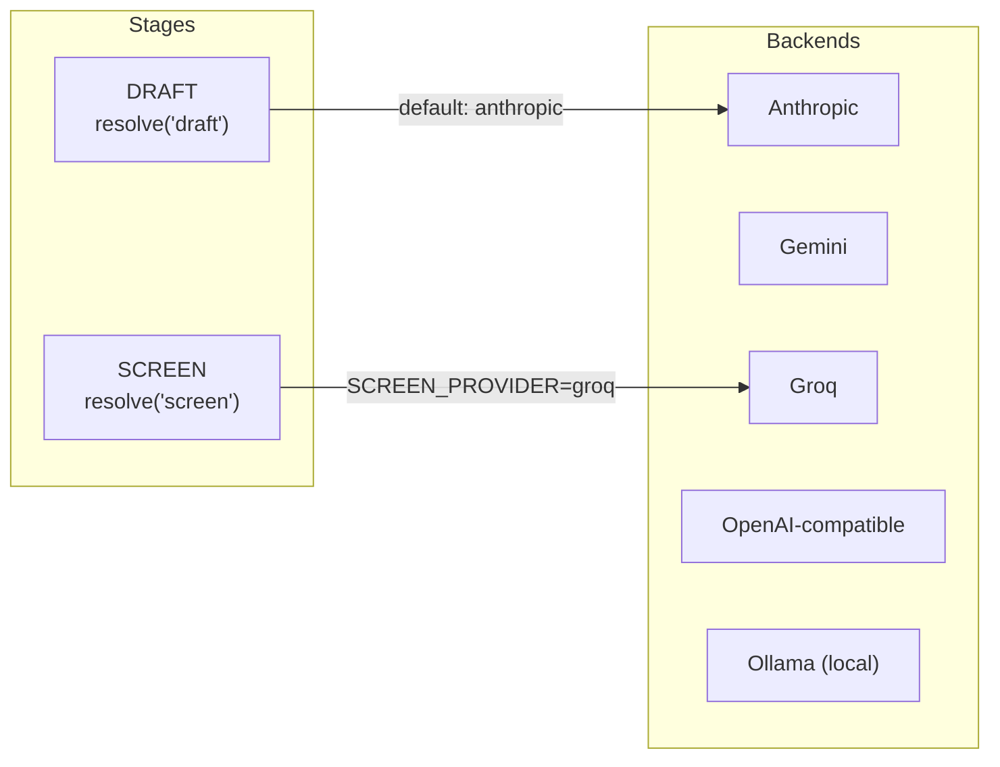

# Jobhunt Pipeline

A personal agent that reads public ATS boards every morning, throws away the
postings that don't fit, scores what's left against a resume, drafts an
application kit for the best few, and emails a digest. **It never presses
submit** — a human reads the digest, edits the note, and applies themselves.

```
2,000 postings scanned  →  ~40 pass the free gate  →  5 in the inbox
```

Everything left of "screen" costs nothing — no LLM call yet.

---

## The five stages

One run of `python -m jobhunt run` walks these in order — the bracketed
numbers are the exact stage counter `cli.py` prints to stdout. The loop at
the bottom is easy to miss: stage 5 writes `seen.json`, and stage 2 reads it
back on the next run — that's the whole "never shown twice" guarantee.



Everything left of SCREEN is deterministic and free — regex and a dict
lookup. Only ~40 candidates ever reach a model, and only the ~5 that clear
the score threshold get the expensive drafting pass.

### Fetch — `[1/5]`
**Files:** `fetch.py`, `mock.py`

HTTP stays out of the parsers on purpose. `fetch_board()` pulls raw JSON;
`parse_greenhouse` / `parse_lever` / `parse_ashby` turn already-decoded JSON
into `Job` objects — which is what lets `--mock` replay bundled fixtures
through the exact same parsing code, not a stand-in.

> **Quirk —** Greenhouse's `content` is HTML-entity-escaped HTML (unescape
> twice); Lever's `createdAt` is epoch-**milliseconds** and the JD is split
> across four fields; Ashby drafts carry `isListed:false` and must be
> skipped.

### Filter — `[2/5]`
**Files:** `prefilter.py`, `store.py`

`prefilter()` applies `include_titles` / `exclude_titles` regex, a location
list, and `max_age_days` — all before a single token is spent. Then
`store.unseen()` drops anything already keyed in `seen.json` by `job_id`.

> **Quirk —** `sde` as a bare regex does **not** match "Software Development
> Engineer" — no shared substring. Needs `\bsde\b` plus the spelled-out
> variant, pinned by a test.

### Screen — `[3/5]`
**Files:** `llm.py`, `providers.py`

Batches ~8 jobs per call with the JD truncated to ~1400 chars, against
whichever model `SCREEN_PROVIDER` names — usually the cheapest. A failed
batch warns and the run continues.

> **Guard —** if *every* batch fails, the run bails instead of recording the
> jobs as seen — so tomorrow's run retries them rather than silently losing
> them.

### Draft — `[4/5]`
**Files:** `llm.py`

One call per job, ~6000 chars of JD, the best model (`DRAFT_PROVIDER`) — but
only for the shortlist that cleared `score_threshold`. This is the stage the
whole pipeline exists to make small.

> **Skipped by —** `--scorer keyword` (the offline dev stub) or
> `--no-draft`.

### Digest — `[5/5]`
**Files:** `digest.py`, `mailer.py`, `store.py`

`digest.build()` renders inline-CSS HTML — Gmail strips `<style>` tags — to
`out/digest.html`. `mailer.send()` fires only with `--send`. Either way,
`store.record()` writes every scanned job to `seen.json`, closing the loop
Filter reads next time.

> **Also —** `store.export_csv()` keeps `out/tracker.csv` in sync, updated
> by `jobhunt applied <job_id>`.

---

## Providers resolve per stage, not per app

`providers.py` defines one interface — `complete()`, plus
`complete_document()` for Anthropic and Gemini — with five backends behind
it. Screen and draft each call `resolve(stage)` independently, so a cheap
model can scan hundreds of postings while a better one drafts the five that
matter, without either stage's code knowing which backend it got.



One configured example: cheap, fast Groq screens the funnel; Anthropic
drafts the shortlist. Swap either env var and the other stage doesn't
notice — both just call `complete()`.

---

## Guardrails, by design

Decisions that keep this safe and cheap to run unattended every morning.

- **It never submits.** Finds, filters, ranks, drafts — a human reads the
  digest, edits the note, and presses submit.
- **The free gate runs first.** Title/location/freshness regex and dedupe
  strip most postings before any model is called — that's the whole cost
  story.
- **The keyword scorer is dev-only.** It's token overlap with no idea what
  the words mean — for proving the plumbing runs, never for a digest you'd
  act on.
- **A failed screening batch doesn't cost you the job.** If scoring fails
  for a batch it's skipped with a warning; if every batch fails, the run
  bails without marking anything seen, so tomorrow retries.
- **Nothing personal enters git.** `profile.json`, `seen.json`, and `.env`
  are gitignored; CI reads `profile.json` from a repository secret instead.
- **`--limit` caps the blast radius.** A bad regex while tuning filters
  can't run up a bill past the cap.

---

## Command reference

| Command | What it does |
|---|---|
| `jobhunt profile --resume resume.pdf` | reads a PDF/txt/md resume into `profile.json` |
| `jobhunt run --mock --scorer keyword` | no key, no network — proves the whole pipeline runs |
| `jobhunt run` | fetch real boards, screen, draft, write today's digest |
| `jobhunt run --send` | ...and actually email it |
| `jobhunt run --limit 10` | cost guard — cap jobs sent to the LLM while tuning |
| `jobhunt run --no-draft` | screen only, skip the expensive drafting pass |
| `jobhunt applied "greenhouse:stripe:5501001"` | mark a job_id applied in the tracker |
| `jobhunt stats` | tracker summary + refresh `out/tracker.csv` |

---

Scheduled by [`.github/workflows/daily.yml`](.github/workflows/daily.yml) at
06:00 IST on weekdays. `seen.json` travels between runs via `actions/cache`,
never committed — a checked-in one would mark every job "already seen" for
anyone who cloned the repo. 55 tests cover the parsers, the prefilter, and
the LLM layer with providers stubbed — no network, no key, no cost.
